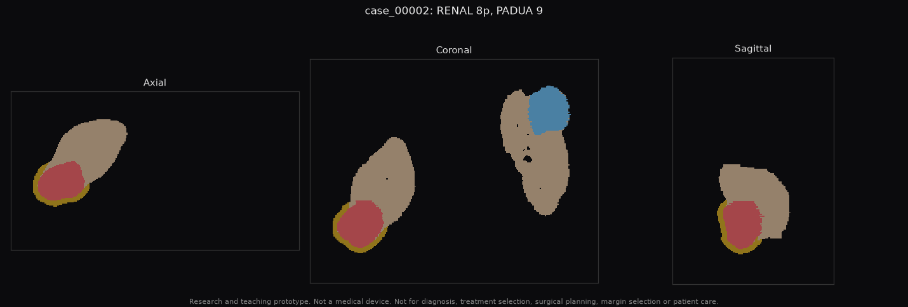
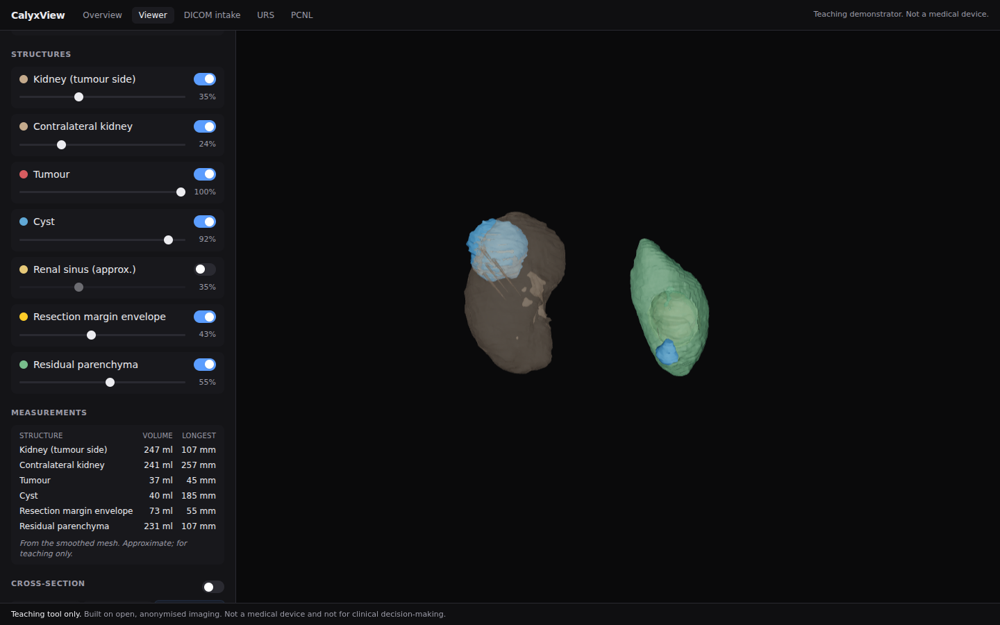

# renalplan results on real KiTS23 masks

> Research and teaching prototype. Not a medical device. Not for diagnosis,
> treatment selection, surgical planning, margin selection or patient care.

Everything here is derived from the **expert reference segmentations** of eight
KiTS23 cases (`case_00000` to `case_00007`, CC BY-NC-SA 4.0). No CT voxels and
no label volumes are committed; the tables, per-case JSON, mask-only overview
images and one viewer screenshot are. Hugging Face was not reachable from the
build environment, so no CT imaging was used in this run: vessels, body outline
and the CT-derived baselines are exercised on the synthetic phantom only.

## 1. Nephrometry and resection geometry on eight real cases

`renalplan batch --kits ~/CalyxView-data/kits --out out/kits` (`nephrometry.csv`,
`cases/<id>/report.md`, `planning.json`, `overview.png`).

| Case | R.E.N.A.L. | PADUA | Tumour (ml) | Diameter (cm) | Exophytic | Tumour to sinus (mm) | Ipsilateral kidney (ml) | Preserved at 5 mm margin |
| --- | --- | --- | --- | --- | --- | --- | --- | --- |
| case_00000 | 5p (low) | 7 | 8.7 | 3.1 | 23% | 39.8 | 190 | 96% |
| case_00001 | 10a (high) | 10 | 2.9 | 2.6 | 0% | 1.1 | 222 | 97% |
| case_00002 | 8p (moderate) | 9 | 37.0 | 4.9 | 28% | 36.1 | 246 | 94% |
| case_00003 | 6x (low) | 8 | 11.4 | 3.3 | 3% | 27.3 | 184 | 94% |
| case_00004 | 7x (moderate) | 9 | 20.2 | 4.3 | 16% | 28.2 | 232 | 95% |
| case_00005 | 9a (moderate) | 10 | 64.4 | 6.2 | 17% | 0.5 | 395 | 96% |
| case_00006 | 9a (moderate) | 11 | 11.3 | 3.6 | 0% | 0.7 | 177 | 95% |
| case_00007 | 5a (low) | 7 | 19.2 | 3.9 | 52% | 26.3 | 250 | 97% |

Runtime 3 to 77 s per case on CPU (dominated by the 0.5 mm-slice cases).
`case_00001` carries a second small tumour component; scores refer to the
index lesion and the report says so. `case_00005` has no contralateral kidney
in the label map. These scores have **not** been compared with surgeon-assigned
scores; that comparison is the first study proposed in
`docs/PARTIAL-NEPHRECTOMY-PLANNING-PROPOSAL.md`.



The bundle for `case_00002` loaded in the CalyxView viewer (tumour-side kidney,
contralateral kidney with cyst, margin envelope, residual parenchyma):



## 2. Post-processing optimisation (simulated errors)

There are no model predictions in this environment, so the reference labels
were degraded with **simulated** errors (`renalplan perturb`: boundary noise,
internal holes, one-voxel tumour erosion, three spurious far components per
case, seed 1; see `postprocess/SIMULATED.json`). These are not model outputs.
They reproduce the failure that dominated the 20-study nnU-Net benchmark on
this site: a mean HD95 of 86 to 158 mm caused by far-away false positives.

`renalplan optimise-postprocess` swept 24 rule combinations on five cases
(`case_00002`, `00003`, `00004`, `00006`, `00007`):

| Rules | Kidney+mass Dice | Mass Dice | Tumour Dice | Tumour HD95 (mm) |
| --- | --- | --- | --- | --- |
| none (simulated input) | 0.988 | 0.820 | 0.797 | 130.9 |
| drop masses smaller than 0.05 ml | 0.994 | 0.841 | 0.820 | 71.3 |
| **keep masses within 5 mm of the kidney** | **0.994** | **0.860** | **0.840** | **2.5** |

The attachment rule alone fixes the far false positives; hole filling and the
kidney size floor change nothing at this precision. Best config
(`postprocess/best_postprocess.json`): two kidney components, masses attached
within 5 mm, no size floors, no hole filling.

`renalplan evaluate` before and after, same five cases, bootstrap 95% CIs in
`evaluation/*/summary.json`:

| Region | Dice raw | Dice cleaned | Surface Dice raw | Surface Dice cleaned | HD95 raw (mm) | HD95 cleaned (mm) |
| --- | --- | --- | --- | --- | --- | --- |
| Kidney + mass | 0.988 | 0.994 | 0.937 | 0.951 | 3.4 | 1.1 |
| Mass | 0.820 | 0.860 | 0.547 | 0.621 | 105.6 | 2.5 |
| Tumour | 0.797 | 0.840 | 0.485 | 0.569 | 130.9 | 2.5 |

The residual tumour Dice gap (0.84 rather than 1.0) is the simulated one-voxel
erosion, which no clean-up rule should recover; it is there so the sweep cannot
"win" by over-fitting. On real model output the same command tunes the same
rules, and the effect is measured the same way.

## 3. Mesh fidelity sweep

`renalplan optimise-mesh` meshes each kidney and tumour mask at Taubin
iterations {0, 5, 10, 15, 25, 40} and decimation targets {4k, 10k, 20k, 40k}
faces, voxelises the mesh back onto the source grid and scores it against the
mask. Results in `mesh/mesh_sweep.csv`, plot in `mesh/mesh_sweep.png`,
recommendation in `mesh/mesh_recommendation.json` (criteria: mean Dice at
least 0.97 and mean absolute volume error at most 3%, then the fewest faces,
then the lowest HD95).

MESH_RESULTS_PLACEHOLDER

## Reproducing

```bash
cd pipeline && pip install -r requirements.txt && pip install -e .
python ../../CalyxView/download_kits_sample.py --cases 8      # or any KiTS23 case folder
renalplan batch --kits ~/CalyxView-data/kits --out out/kits
renalplan perturb --kits ~/CalyxView-data/kits --out sim --tumour-erode
renalplan optimise-postprocess --pred sim --ref ~/CalyxView-data/kits --cases case_00002 case_00003 case_00004 case_00006 case_00007 --out out/pp
renalplan evaluate --pred sim --ref ~/CalyxView-data/kits --cases ... --out out/eval_raw
renalplan evaluate --pred sim --ref ~/CalyxView-data/kits --cases ... --postprocess out/pp/best_postprocess.json --out out/eval_pp
renalplan optimise-mesh --kits ~/CalyxView-data/kits --cases case_00002 case_00003 case_00006 --out out/mesh
```
