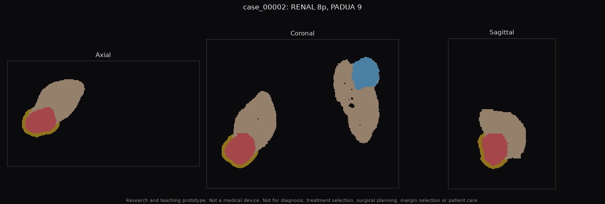
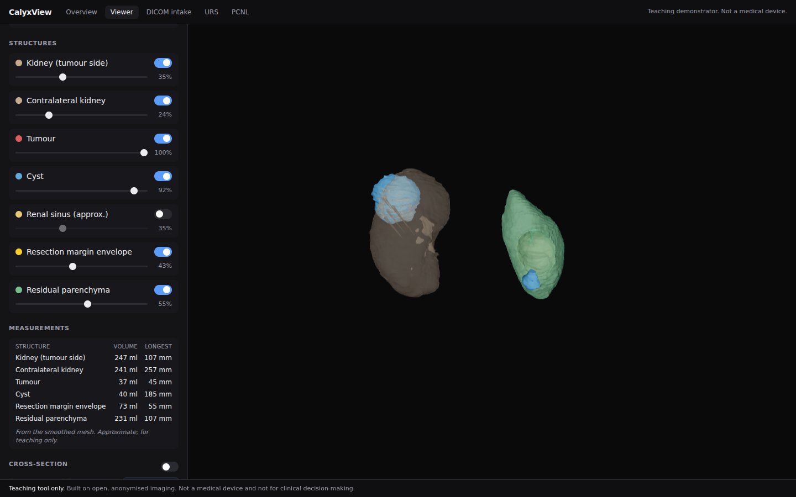
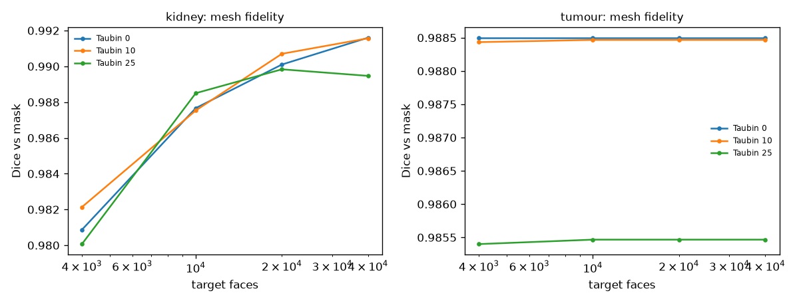

# renalplan results on real KiTS23 outlines

> Research and teaching prototype. Not a medical device, and not for patient care.

Everything here comes from the expert outlines (reference segmentations) of eight
KiTS23 cases, `case_00000` to `case_00007`. KiTS23 imaging and labels are
CC BY-NC-SA 4.0. No CT voxels or label volumes are committed. The tables, the
per-case JSON, mask-only overview images and one viewer screenshot are.

These runs used the outlines only. No CT went in, so there are no vessels, no
body outline and no distances to vessels or the collecting system. The vessel
and body-outline steps have only run on the synthetic test phantom, whose only
vessel is an aorta. The collecting-system steps haven't run on anything yet,
because there's no collecting-system outline, synthetic or real.

The five kidney meshes shown on the site (`public/models/reference-a..e.glb`)
are not renalplan output. They were made from the same KiTS23 outlines by the
mesh step of my separate CalyxView endourology project, which isn't public yet.
The scores next to them on the site are the renalplan numbers below.

## 1. Scores and volumes on eight real cases

`renalplan batch --kits ~/CalyxView-data/kits --out out/kits --no-ct`, with
renalplan 0.2.0 on 29 September 2026. From each case folder I committed
`planning.json`, `report.md`, `manifest_entry.json` and `overview.png`, plus
`nephrometry.csv`. The GLB meshes stay out of git.

| Case | R.E.N.A.L. | PADUA | Tumour (ml) | Diameter (cm) | Exophytic | Tumour to sinus (mm) | Tumour-side kidney (ml) | Kept at 5 mm margin |
| --- | --- | --- | --- | --- | --- | --- | --- | --- |
| case_00000 | 6p (low) | 7 (low) | 8.7 | 3.1 | 23% | 39.8 | 190 | 96% |
| case_00001 | 10a (high) | 10 (high) | 2.9 | 2.6 | 0% | 1.1 | 222 | 97% |
| case_00002 | 8p (moderate) | 9 (intermediate) | 37.0 | 4.9 | 28% | 36.1 | 246 | 94% |
| case_00003 | 8x (moderate) | 9 (intermediate) | 11.4 | 3.2 | 2.5% | 27.3 | 184 | 94% |
| case_00004 | 7x (moderate) | 8 (intermediate) | 20.2 | 4.3 | 16% | 28.2 | 232 | 95% |
| case_00005 | 9a (moderate) | 9 (intermediate) | 64.4 | 6.2 | 17% | 0.5 | 395 | 96% |
| case_00006 | 9a (moderate) | 10 (high) | 11.3 | 3.6 | 0.1% | 0.7 | 177 | 95% |
| case_00007 | 5a (low) | 6 (low) | 19.2 | 3.9 | 52% | 26.3 | 250 | 97% |

The site numbers these 1 to 8 in the same order, and kidneys A to E in the 3D
viewer are the first five. The diameter of `case_00003` is 3.25 cm before
rounding. It's shown as 3.2 here, on the site and in its report.

Each case took 1.6 to 18.2 s on a CPU, median 8.3 s. The 0.5 mm-slice cases took
longest. That's the whole run per case, including meshing, the report and the
overview image.

### What changed from the 3 September run

The first published run (renalplan 0.1.0, 3 September 2026) scored the location
items differently. I changed two rules and reran all eight cases:

- **Polar lines when the sinus estimate is unusable.** The lines are normally
  set at the 5th and 95th percentiles of the estimated sinus along the kidney's
  long axis. In `case_00000` and `case_00003` that estimate came out as a sliver
  (6.4 and 11.5 mm long), sitting wholly above the kidney's middle, so the old
  lines put both tumours entirely below the lower line. A real hilum straddles
  the middle, so an estimate that spans less than 20 mm or doesn't straddle the
  kidney's centroid is no longer used. The lines then go where 30% of the
  kidney's volume lies beyond each (the 30th and 70th percentiles of kidney
  voxels along the axis, roughly a third and two thirds of the way along).
  `case_00000` went from 5p to 6p (L 1 to 2). `case_00003` went from 6x (low)
  to 8x (moderate) (L 1 to 3) and PADUA 8 to 9 (inferior to between the poles).
- **The PADUA pole.** The old rule called a tumour polar only if it lay
  entirely beyond a line, so any tumour touching the middle band scored 2. Now
  it's between the poles (2) only if more than half of it lies between the
  lines, the rule Wood et al. used to automate PADUA (BJU Int 2024). Later
  descriptions of PADUA split crossing tumours at 50% too. I couldn't read
  Ficarra's 2009 paper itself, so I haven't checked its own wording for a
  tumour that crosses a line. `case_00004` went from PADUA 9 to 8 (17.7% of the
  tumour between the lines), `case_00005` from 10 (high) to 9 (intermediate)
  (49.3%), `case_00006` from 11 to 10 (5.8%) and `case_00007` from 7 to 6
  (13.9%). In `case_00000` the two changes cancel out for PADUA: the new lines
  alone would have made it 8, and the new rule keeps it at 7.

Three smaller fixes changed no score here. The axial midline for L is now the
plane half-way between the polar lines, as Kutikov and Uzzo define it, rather
than the kidney's centroid. R.E.N.A.L. R now scores exactly 7.0 cm as 3. And
each measurement is rounded to the precision it's stored at before it's
scored, so R.E.N.A.L., PADUA and the reports can't disagree at a cut-off. R,
E, N, A, the volumes and the margin numbers are the same as on 3 September.
The runtimes are shorter because this run was on a different machine. The
0.1.0 code takes about as long as 0.2.0 on it (1.7 to 22.7 s).

renalplan 0.2.0 also flags a sinus estimate far too big to be a renal sinus
(see `case_00005` below). That adds a note but changes no score.

How to read the scores:

- The R.E.N.A.L. hilar (h) suffix wasn't assessed, because there's no vessel
  outline. `hilar: false` in `planning.json` is a default, not a finding.
- PADUA's collecting-system item wasn't assessed either (no excretory phase) and
  defaults to 1 point. So a PADUA total can be one point low, most likely for
  `case_00001` and `case_00006`, which sit within about 1 mm of the sinus.
  `case_00005` also reads 0.5 mm, but to a sinus estimate that means little
  (see below).
- N is the distance to the renal sinus, and the sinus is approximated from the
  kidney outline (the space inside the kidney's convex hull that is neither
  kidney nor tumour).
- A tumour with 5% or less outside the kidney's convex outline is scored as
  entirely endophytic (E 3). That's why `case_00003`, at 2.5%, scores 8x.
  Counting that 2.5% as exophytic, it would be 7x, and PADUA 8 rather than 9.
- L and the PADUA pole are approximate for every case. Both scores set their
  lines on axial CT slices, and each defines them differently: R.E.N.A.L. where
  the medial lip of kidney is broken by the hilum, PADUA at the upper and lower
  edges of the sinus fat. KiTS doesn't outline the sinus, so renalplan
  estimates it from the kidney outline and uses one pair of planes across the
  kidney's own long axis for both scores. The axial midline for L is half-way
  between them.
- In `case_00000` and `case_00003` the polar lines were assumed (see above),
  so their L and PADUA pole are rougher than the rest. N and PADUA's rim and
  sinus items still use the small sinus estimate, so they're approximate too,
  and N may read long. Both reports say so. `case_00003` is close to the line:
  its L 3 and PADUA middle rest on 66% of the tumour lying between the assumed
  lines, and narrower lines would make it L 2 and PADUA inferior.
- `case_00001` has a second, smaller tumour. Its scores and tumour volume are
  for the larger one, and the report says so.
- `case_00005`'s kidney outline looks like a horseshoe kidney: one U-shaped
  piece of 395 ml, about 17 cm from side to side, with only 0.4 ml labelled
  kidney anywhere else. renalplan treats the whole piece as the tumour-side
  kidney, so its "long axis" runs mostly side to side and its sinus estimate
  (246 ml) is the space between the two limbs. renalplan now flags a sinus
  estimate that big (more than a quarter of the kidney's volume, or more than
  half its length) as implausible. For this case L, N and PADUA's pole, rim
  and sinus items don't mean much, and its PADUA pole rests on 49.3% of the
  tumour lying between the lines, just under the 50% cut.
- "Kept at 5 mm margin" is the tumour-side kidney volume outside a uniform 5 mm
  band round the tumour. It's volume, not function. Real partial nephrectomies
  usually lose more than this, through the renorrhaphy and devascularised
  tissue, even when the excision is narrower (median kept 84% in Kazama et al.,
  BJU Int 2024).

These scores haven't been compared with clinicians' scores. That comparison is
the first study proposed in `docs/PARTIAL-NEPHRECTOMY-PLANNING-PROPOSAL.md`.



The renalplan bundle for `case_00002` loaded in my CalyxView viewer (tumour-side
kidney, the other kidney with its cyst, margin envelope, the kidney that would be
left):



## 2. Clean-up rules, tested on errors I simulated

There are no model outputs in this folder. To test the clean-up rules I took the
reference outlines and added errors on purpose (`renalplan perturb
--tumour-erode`, seed 1; see `postprocess/SIMULATED.json`). Only two of the
errors actually happened:

- every tumour was eroded by one voxel, and
- three speckled blobs were placed away from the kidney in each case, about 70%
  labelled kidney and 30% tumour.

The perturb command also has boundary-noise and hole steps, but neither changed
anything. Their thresholds (0.6 and 1.6) are far above the spread of the smoothed
noise they're applied to (standard deviation about 0.01 and 0.03), and
`SIMULATED.json` records 0 hole voxels in every case. Its warning text still
lists them, which is wrong.

The blobs are meant to mimic one problem in the 20-scan nnU-Net benchmark on
the site: a mean HD95 of 86 to 158 mm. That mean is driven by the one failed
scan, which is scored at the scan's full diagonal, and by stray false positives
far from the kidney.

`renalplan optimise-postprocess` scored 24 rule combinations on five cases
(`case_00002`, `00003`, `00004`, `00006`, `00007`). Every combination keeps the
two largest kidney pieces, so that rule is named in each row:

| Rules | Kidney + mass Dice | Mass Dice | Tumour Dice | Tumour HD95 (mm) |
| --- | --- | --- | --- | --- |
| none (simulated input) | 0.988 | 0.820 | 0.797 | 130.9 |
| two largest kidney pieces | 0.992 | 0.820 | 0.797 | 130.9 |
| two largest kidney pieces + drop tumour or cyst pieces under 0.05 ml | 0.994 | 0.841 | 0.820 | 71.3 |
| **two largest kidney pieces + tumour or cyst only within 5 mm of the kidney** | **0.994** | **0.860** | **0.840** | **2.5** |

Keeping the two largest kidney pieces removes the kidney-labelled blobs and on
its own takes kidney + mass Dice from 0.988 to 0.992. Keeping tumour or cyst only
within 5 mm of the kidney then removes the tumour-labelled speckle. Eight combinations
tie for best: attaching at 10 mm gives the same numbers as 5 mm, and the size
floors for kidney and tumour pieces make no difference once the attachment rule
is on.

The hole-filling result is moot. There were no holes to fill, and turning it on
made kidney + mass slightly worse (Dice 0.9945 to 0.9942, HD95 1.1 to 1.3 mm).
Best config (`postprocess/best_postprocess.json`): two kidney pieces, tumour and
cyst attached within 5 mm, no size floors, no hole filling.

`renalplan evaluate` before and after, same five cases, bootstrap 95% CIs in
`evaluation/*/summary.json`:

| Region | Dice raw | Dice cleaned | Surface Dice raw | Surface Dice cleaned | HD95 raw (mm) | HD95 cleaned (mm) | Volume error raw (ml) | Volume error cleaned (ml) |
| --- | --- | --- | --- | --- | --- | --- | --- | --- |
| Kidney + mass | 0.988 | 0.994 | 0.937 | 0.951 | 3.4 | 1.1 | 4.1 | 5.2 |
| Mass | 0.820 | 0.860 | 0.547 | 0.621 | 105.6 | 2.5 | 3.1 | 4.9 |
| Tumour | 0.797 | 0.840 | 0.485 | 0.569 | 130.9 | 2.5 | 3.1 | 4.9 |

Tumour Dice stops at 0.84 because every tumour was eroded by a voxel, and no
clean-up rule can put that back. It's also why volume error gets worse after
clean-up: with the blobs gone only the erosion is left, so every volume reads
low.

One limitation of the scoring itself: `evaluate` and `optimise-postprocess` crop
every volume to the reference labels' bounding box plus 40 mm before scoring
(`cli.py`, `crop_to`). An older code comment called it a union crop, but it
isn't. So a false positive more than 40 mm outside that box isn't counted at all, and some
of the simulated blobs (placed up to 80 voxels outside the box) will have been
cut off before scoring. On real model output this would hide exactly the far
false positives the rules are aimed at, so the crop needs fixing first.

What this shows: the code does what it should on errors I put there. It doesn't
show the rules help on real model output. The next step is to run them on the
benchmark's 19 nnU-Net outputs.

## 3. Mesh fidelity sweep

`renalplan optimise-mesh` meshes each kidney and tumour mask at Taubin
iterations {0, 10, 25} and decimation targets {4k, 10k, 20k, 40k} faces,
voxelises the mesh back onto the source grid and scores it against the mask.
Results in `mesh/mesh_sweep.csv`, plot in `mesh/mesh_sweep.png`,
recommendation in `mesh/mesh_recommendation.json` (criteria, on the mean over
cases: Dice at least 0.97 and absolute volume error at most 3%, then the fewest
faces, then the lowest HD95).

Three cases (`case_00002`, `00003`, `00006`), kidney label (both kidneys) and
tumour, mean over cases:

| Structure | Taubin | Target faces | Dice vs mask | HD95 (mm) | abs. volume error |
| --- | --- | --- | --- | --- | --- |
| Kidney | 0 | 4,000 | 0.981 | 1.6 | 1.2% |
| Kidney | 10 | 10,000 | 0.988 | 2.0 | 1.3% |
| Kidney | 10 | 20,000 | 0.991 | 1.5 | 1.7% |
| Kidney | 0 | 40,000 | 0.992 | 1.5 | 1.5% |
| Kidney | 25 | 40,000 | 0.990 | 3.1 | 1.2% |
| Tumour | 0 to 10 | any | 0.988 | 0.9 | 2.3% |
| Tumour | 25 | any | 0.985 | 0.9 | 2.2% |

Averaged over the three cases, every setting keeps Dice at 0.980 or better and
volume error at 2.33% or less. Single cases go further: Dice down to 0.970
(`case_00006` kidney, no smoothing, 4,000 faces) and volume error up to 3.66%
(`case_00006` kidney, 10 iterations, 20,000 faces). The criteria are on the
means, so that single case doesn't fail them.

The recommendation file picks the smallest setting that meets the criteria:
4,000 faces, no smoothing (kidney Dice 0.981, HD95 1.6 mm). The pipeline's
default for the viewer, 20,000 faces with 15 Taubin iterations, wasn't in this
sweep, so it needs running before anyone quotes numbers for it. The nearest
settings tested, 20,000 faces at 10 and 25 iterations, gave HD95 1.5 and 1.4 mm
and volume error 1.7% and 1.5%.

Tumours are small, about 7,000 to 20,000 faces before decimation, so only the
4,000 and 10,000 targets decimate them, and Dice doesn't change at 3 dp when
they do. Heavy smoothing (25 iterations) starts to shrink them.



## Reproducing

`download_kits_sample.py` is in my CalyxView repository, which isn't public yet.
Any folder of KiTS23 cases in the standard layout works in its place.

```bash
cd pipeline && pip install -r requirements.txt && pip install -e .
python ../../CalyxView/download_kits_sample.py --cases 8      # or any KiTS23 case folder
renalplan batch --kits ~/CalyxView-data/kits --out out/kits --no-ct
# copy planning.json, report.md, manifest_entry.json and overview.png from each
# out/kits/<case> into results/cases/<case>, and out/kits/nephrometry.csv into results/
renalplan perturb --kits ~/CalyxView-data/kits --out sim --tumour-erode
renalplan optimise-postprocess --pred sim --ref ~/CalyxView-data/kits --cases case_00002 case_00003 case_00004 case_00006 case_00007 --out out/pp
renalplan evaluate --pred sim --ref ~/CalyxView-data/kits --cases ... --out out/eval_raw
renalplan evaluate --pred sim --ref ~/CalyxView-data/kits --cases ... --postprocess out/pp/best_postprocess.json --out out/eval_pp
renalplan optimise-mesh --kits ~/CalyxView-data/kits --cases case_00002 case_00003 case_00006 --out out/mesh
python scripts/make_public_summary.py   # rebuilds summary.public.json for the site
cd .. && node scripts/make-reference-cases.mjs <CalyxView models folder>   # Kidneys A to E on the site
```

If `renalplan` was pip-installed from another copy of the code, the command can
run that copy instead of this one. Check with
`python -c "import renalplan; print(renalplan.__file__, renalplan.__version__)"`,
and reinstall from this folder or run `python -m renalplan.cli` from `pipeline/`.
